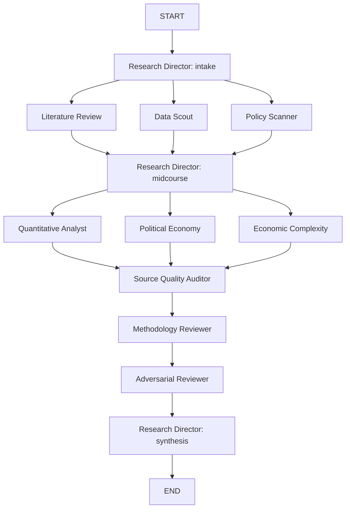

# Architecture

`ai-policy-lab` uses a LangGraph DAG to move a policy question through discovery, analysis, quality review, and synthesis.

## Workflow

## Phases

1. Phase 0 intake: the Research Director decomposes the root question into sub-questions.
2. Phase 1 discovery: literature, datasets, and policy context are gathered in parallel.
3. Phase 1.5 refinement: the Research Director adjusts scope after discovery.
4. Phase 2 analysis: quantitative, political-economy, and economic-complexity analysis run in parallel.
5. Phase 3 quality gate: source audit, methodology review, and adversarial review run sequentially.
6. Phase 4 synthesis: the Research Director assembles the final report.

## Shared State

The system passes one `ResearchState` dictionary through the graph. Important fields include:

- `root_question` and `domain_constraints`
- `research_questions`
- `sources` and `datasets`
- `findings`
- `quantitative_results`
- `source_audit_report` and `methodology_review`
- `adversarial_review`
- `executive_summary` and `full_report`
- `run_status` and `run_errors`

Append-only list fields use LangGraph reducers so multiple agents can contribute without overwriting one another.

## Agents

| Agent | Responsibility |
|---|---|
| Research Director | Decompose, refine, and synthesize the run |
| Literature Review | Survey and summarize prior work |
| Data Scout | Catalog datasets and data gaps |
| Policy Scanner | Gather institutional and regulatory context |
| Quantitative Analyst | Produce descriptive empirical analysis |
| Political Economy | Interpret distributional and institutional effects |
| Economic Complexity | Analyze place-based capability and transition logic |
| Source Quality Auditor | Check source tiers and citation integrity |
| Methodology Reviewer | Check design, rigor, and replicability |
| Adversarial Reviewer | Stress-test findings with counterarguments |

## Connectors

| Connector | Purpose | Notes |
|---|---|---|
| BLS | Employment and wage data | Live API support with rate limiting and retries |
| Census | ACS, CBP, and related public datasets | Live API support with caching |
| FRED | Macro labor-market time series | Requires `FRED_API_KEY` |
| O*NET | Occupation tasks, skills, and technology references | Supports public text release and authenticated web service access |
| Federal Register | Federal policy scan | Used for primary-source institutional context |
| Crossref | DOI and paper metadata enrichment | Uses configured contact email when present |
| Semantic Scholar | Academic search | Live API path supported |
| Web search | Future integration point | Interface reserved for a future provider integration |

## Runtime Behavior

- Mock mode returns deterministic fallback text and is intended only for explicit validation runs.
- Live mode uses the configured OpenAI-compatible endpoint.
- The runtime sanitizes user input before it enters prompt construction.
- Graph execution records partial state and failure details when a node raises.

## Research Tracks

- Great Reallocation: the flagship AI labor-market question with specialized discovery and analysis paths.
- Upskilling Pathways: a Brookings continuation track focused on mobility infrastructure and new transition pathways.

## Current Release Status

This architecture is ready for an early public release and local development. The most mature research coverage is currently in labor-market and AI-at-work questions, while broader policy-domain generalization is still in progress. It is not yet a full production research platform with a persistent knowledge base or notebook-generation pipeline, but the main DAG, connectors, and quality gates are operational.
